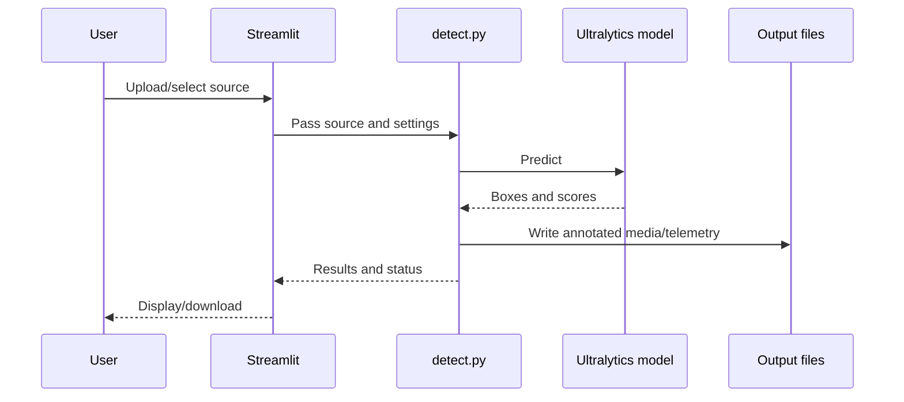

# Component interactions

```mermaid
sequenceDiagram
  participant U as User
  participant S as Streamlit
  participant D as detect.py
  participant M as Ultralytics model
  participant O as Output files
  U->>S: Upload/select source
  S->>D: Pass source and settings
  D->>M: Predict
  M-->>D: Boxes and scores
  D->>O: Write annotated media/telemetry
  D-->>S: Results and status
  S-->>U: Display/download
```
