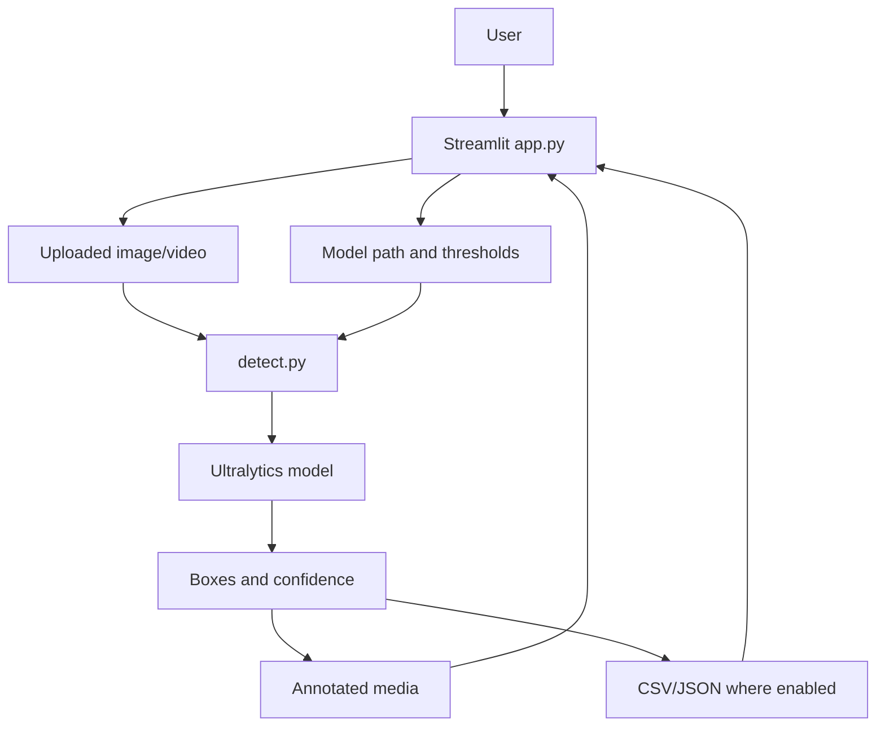

# System architecture

```mermaid
flowchart TB
  User[User] --> UI[Streamlit app.py]
  UI --> Upload[Uploaded image/video]
  UI --> Settings[Model path and thresholds]
  Upload --> Engine[detect.py]
  Settings --> Engine
  Engine --> YOLO[Ultralytics model]
  YOLO --> Detections[Boxes and confidence]
  Detections --> Render[Annotated media]
  Detections --> Telemetry[CSV/JSON where enabled]
  Render --> UI
  Telemetry --> UI
```

The architecture is a Streamlit application calling Python inference functions, not a separately deployed frontend/backend service.
